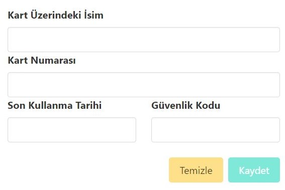
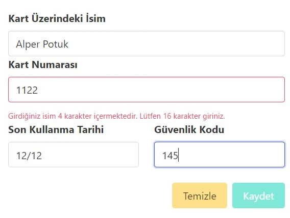
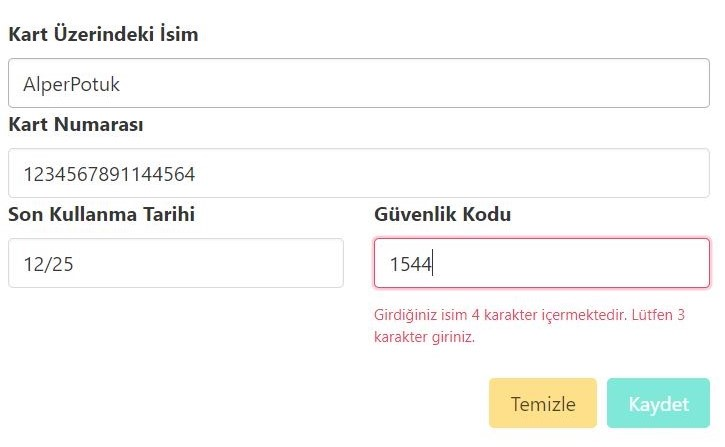
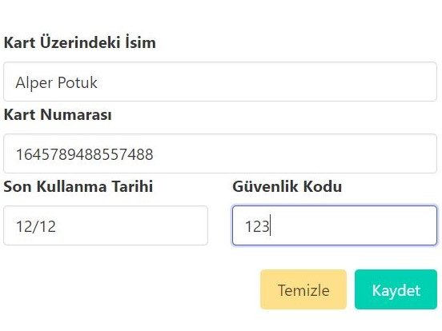

# Angular-Reactive-Forms-Projesi
Angular Forms Yapısı Öğrenimi İçin Yaptığım Kredi Kartı Bilgilerini Form İle Alma Projesi
#
* Proje Angular kullanılarak oluşturuldu.
* Bulma ile görüntü düzenlendi.
#
*Proje temel olarak Kart Üzerindeki İsim, Kart Numarası, Son Kullanma Tarihi ve Güvenlik Kodu bilgilerini alan bir formdur.
*Temizle ve Kaydet isimli iki butona sahiptir.
*Temizle butonu formu temizlerken, Kaydet butonu giriş için geçerli veriler girilmeden aktif olmamaktadır.

*Form, karakter sayısının veya formatın geçersiz olduğu durumlarda uyarı vermektedir. 
* 

*Bütün bilgilerin belirtilen şekilde girilmesinin ardından Kaydet butonu aktif olmaktadır.

